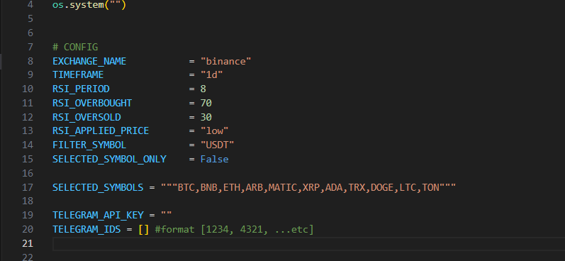

**CRYPTO BUY AND HOLD SIGNAL BOT**

This is a simple crypto signal bot base on technical analysis, This bot is meant to send a buy signal to telegram
Disclaimer: Before executing the signal provided by this bot make sure to apply your own analysis!

website: https://fluronix.com/

discord: https://discord.gg/sy5XfqK3ZA

Get a vps server to host your bot: http://click.dreamhost.com/aff_c?offer_id=8&aff_id=12694

**How to set up:**

1. Clone the repo
2. Cd to the cloned dirrectory
3. Run pip install -r requirements.txt
4. On the signal_bot.py they are config variables like on the image

Note the parameters are case sensitive.

The FILTER_SYMBOL variable is use to filter only pairs that have the asigned symbol (USDT by default)

If The SELECTED_SYMBOL_ONLY varible is set to False then bot will scan all the USDT pairs on the exchange, if set to True then bot will use the symbols in SELECTED_SYMBOL string. Note the symbols should be comma seperated

Paste your telegram bot api key on TELEGRAM_API_KEY and your telegram id in TELEGRAM_IDS

Note the telegram ID is not a username, it is a unique ID asigned to each telegram user. Use this bot to check your telegram ID https://t.me/FluronixTradeAlert_bot

Now run "python signal_bot.py" or "python3 signal_bot.py" for linux to kickstart your bot

Notes

You need to send your telegram bot a message first to initialize it to send you a message as well if you just created it new

Use Pm2 to run your bot on deamon https://www.npmjs.com/package/pm2

Enjoy and feel Feel Free to contrubute
